# CS304 SUSTech_ACD 经费管理系统 Final Report

## 1.	Metrics
Use the IDEA plug-in Static to count the number of lines of various types of code, the number and size of files as follows:
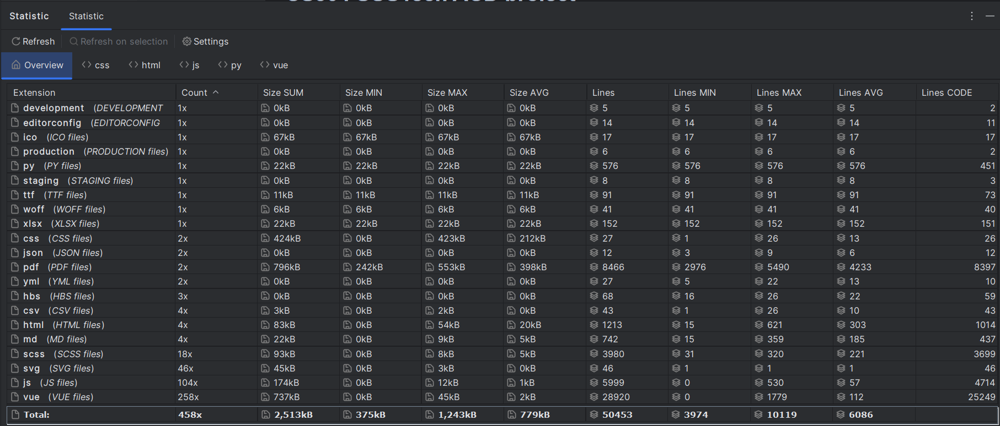
A total of 476 software packages were obtained using the IDEA code analysis function.
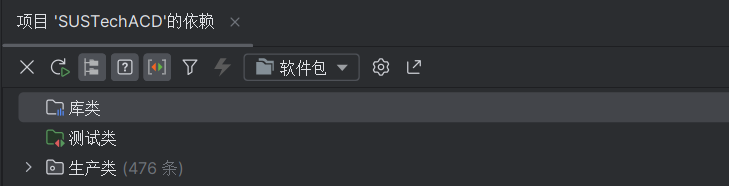
A total of 6 sub-modules: backend, frontend, build, mock, test, drawing;

The backend is divided into three sub-modules: data (csv), server, and test;

The front end is divided into api, assets, components, directive, filters, icons, layout, router, store, styles, utils, vendor, view multiple sub-modules.

The third-party libraries used by the backend are:
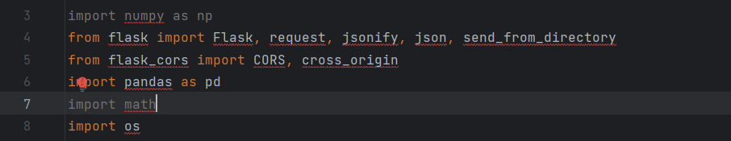
The third-party libraries used by the front end are:

"dependencies": {
"axios": "0.18.1",
"clipboard": "2.0.4",
"codemirror": "5.45.0",
"core-js": "3.6.5",
"driver.js": "0.9.5",
"dropzone": "5.5.1",
"echarts": "4.2.1",
"echarts-stat": "^1.2.0",
"echarts-wordcloud": "^1.1.3",
"element-ui": "2.13.2",
"file-saver": "2.0.1",
"fuse.js": "3.4.4",
"js-cookie": "2.2.0",
"jsonlint": "1.6.3",
"jszip": "3.2.1",
"normalize.css": "7.0.0",
"nprogress": "0.2.0",
"path-to-regexp": "2.4.0",
"screenfull": "4.2.0",
"script-loader": "0.7.2",
"sortablejs": "1.8.4",
"tui-editor": "1.3.3",
"vue": "2.6.10",
"vue-count-to": "1.0.13",
"vue-router": "3.0.2",
"vue-splitpane": "1.0.4",
"vuedraggable": "2.20.0",
"vuex": "3.1.0",
"xlsx": "0.14.1"
},
"devDependencies": {
"@vue/cli-plugin-babel": "4.4.4",
"@vue/cli-plugin-eslint": "4.4.4",
"@vue/cli-plugin-unit-jest": "4.4.4",
"@vue/cli-service": "4.4.4",
"@vue/test-utils": "1.0.0-beta.29",
"autoprefixer": "9.5.1",
"babel-eslint": "10.1.0",
"babel-jest": "23.6.0",
"babel-plugin-dynamic-import-node": "2.3.3",
"chalk": "2.4.2",
"chokidar": "2.1.5",
"connect": "3.6.6",
"eslint-plugin-vue": "",
"html-webpack-plugin": "3.2.0",
"husky": "1.3.1",
"lint-staged": "",
"mockjs": "1.0.1-beta3",
"plop": "2.3.0",
"runjs": "4.3.2",
"sass": "1.26.2",
"sass-loader": "8.0.2",
"script-ext-html-webpack-plugin": "2.1.3",
"serve-static": "1.13.2",
"svg-sprite-loader": "4.1.3",
"svgo": "1.2.0",
"vue-template-compiler": "2.6.10"
}

There are 60 in total.

### Maintainability
> The tool used is: SonarLint
> The open-source project for comparison is: vue-element-admin

Analysis results of this project: 213 issues
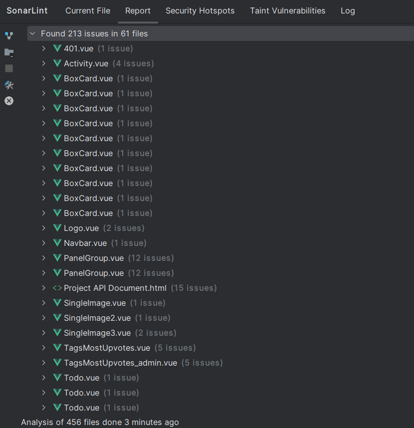
The analysis result of the comparison project is: 48 issues
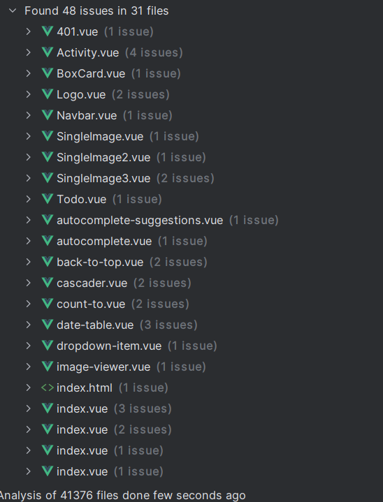
As you can see, the maintainability of our project is very good.

## 2.	Documentation

Documentation分为用户端文档和开发者文档两个部分。

### User-end document

#### SUSTech ACD 经费管理系统 - 用户端使用文档

URL: https://github.com/skylynf/SUSTechACD/blob/main/%E7%94%A8%E6%88%B7%E7%AB%AF%E6%96%87%E6%A1%A3.pdf

上述文档是一个用户端使用文档的示例，它旨在帮助用户理解和操作系统的各个功能模块。该文档提供了以下内容：

1. **简介**：介绍了系统的基本概念，如课题组、经费和支出之间的关系，以及一些限制条件。
2. **操作列表**：列出了用户可以执行的各种操作，包括查询、审批、增加/删除、修改等。
3. **用户使用内容**：描述了用户在系统中的角色和相关操作，包括登录、注册、导航栏功能和各个模块的具体功能。
4. **导出功能**：说明了用户可以使用导出功能将生成的Excel表格导出的方法。

整个文档结构清晰，按照不同功能模块分别进行介绍，并提供了具体的操作步骤和注意事项。文档旨在帮助用户快速上手系统，了解每个功能的用途和操作方法，以提高用户的使用体验。

##### 目录

1. 登录和注册
2. 导航栏功能说明
3. 展示模块
4. 支出模块
5. 经费模块
6. 审批模块
7. 导出功能


#### Screenshot

>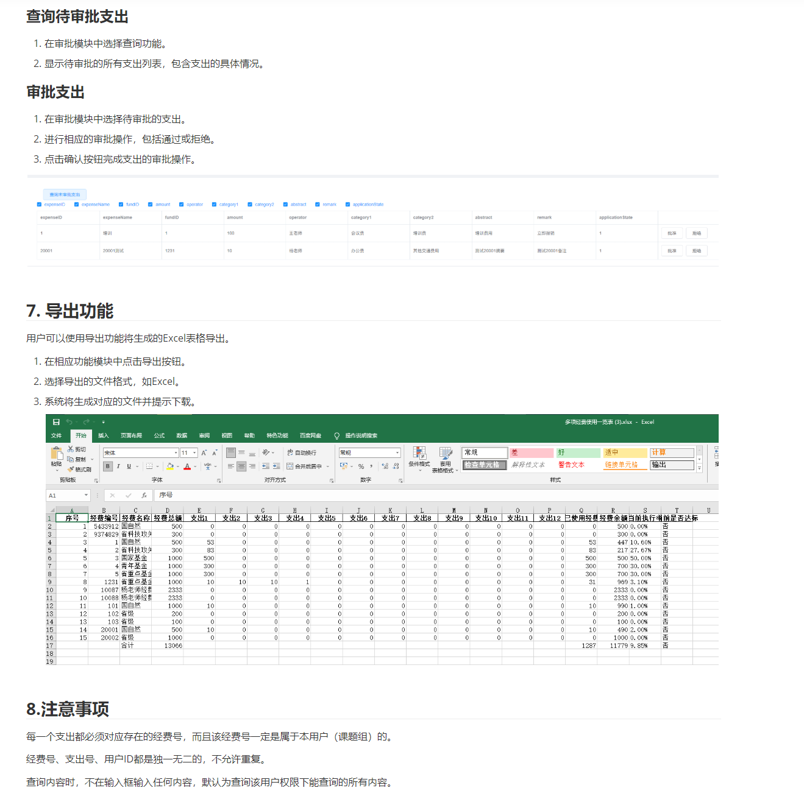


### Developer-end document

URL: https://github.com/skylynf/SUSTechACD/blob/main/Project%20API%20Document.pdf

这份文档是SUSTech_ACD API开发者文档，用于介绍SUSTech_ACD财务管理系统的API接口及其使用方法。该系统用于管理课题组的经费和支出情况。

以下是文档的目录：

1. 简介
2. 操作列表
   - 总览
     - 查询某课题组名下的全部经费的完成情况（支出情况）
     - 查询一笔支出的申请情况
     - 可视化查看一笔经费的使用情况和支出项目
     - 查询若干个fundID的使用情况和执行率
   - 审批
     - 查询待审批的所有支出列表
     - 审批支出
   - 增加/删除
     - 增加或删除一个经费
     - 增加或删除一个支出
   - 修改
     - 修改一个支出并重新送审
     - 修改一个经费
3. Json对象内容示例
   - 经费（fund）
   - 支出（expense）
   - 课题组（user）
4. 后端API
   - 获取课题组全部经费完成情况（支出情况）
   - 查询若干个fundID的使用情况和执行率，或是所有fundID的使用情况和执行率
   - 查询一笔支出的申请情况
   - 查询待审批的所有支出列表
   - 增加或删除一个经费
   - 增加或删除一个支出
   - 送审一个支出
   - 修改一个支出并重新送审
   - 修改一个经费
   - 用户操作
     - 增加用户
     - 修改用户
     - 删除用户
     - 用户登录
5. 注意事项

该文档提供了系统中各种操作的API接口说明，包括请求方式、路径、参数和响应等信息。开发者可以根据文档中的接口定义和示例，进行后端API的实现和功能完善。此外，文档还提供了一些注意事项，如占位符替换和后端实现建议等。


#### ScreenShot

> 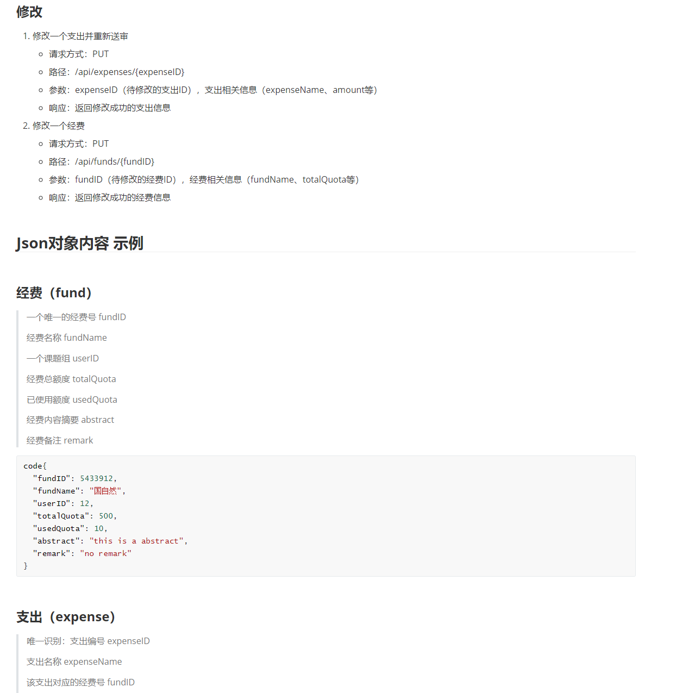


## 3.	Tests

### 3.1 Front-end Test

**3.1.1** The front-end testing is completed using Jest, an open-source JavaScript testing framework from Facebook that automatically integrates all the testing tools required by developers such as assertions, JSDom, and coverage reports. It is an almost zero configuration testing framework。

**3.1.2** Test code example：

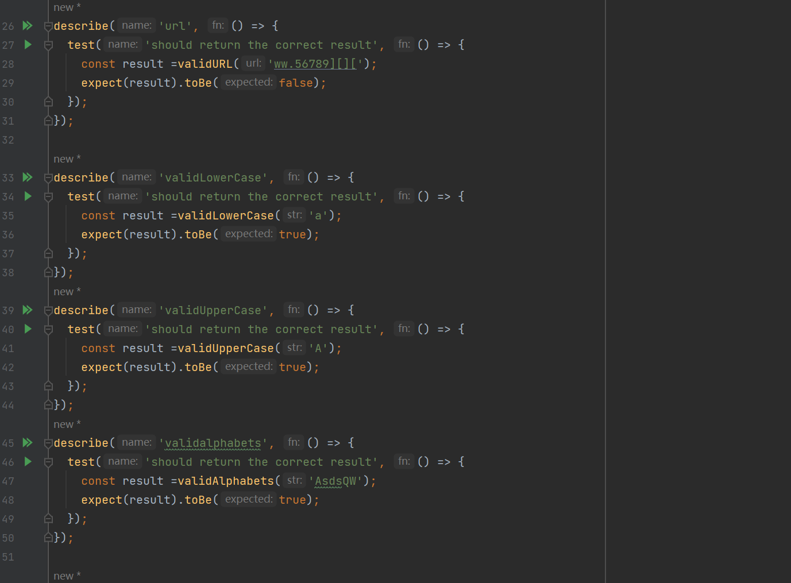

**3.1.3** Test Coverage:

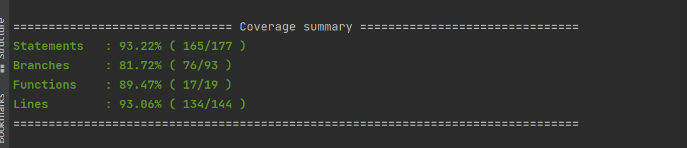

### 3.2 Back-end Test

**3.2.1** 后端测试使用python的unittest, 一个典型的测试方法实现如下

```python
def test_get_expense_by_id(self):
    # 发送 GET 请求并获取响应
    response = self.app.get('/api/expenses/1')
    # 验证状态码是否为 200
    assert response.status_code == 200
    # 获取响应数据
    data = response.get_json()
    # 验证数据内容
    assert 'error' not in data  # 没有错误信息表示成功
    assert isinstance(data, dict)  # 数据类型为字典
    assert 'expenseID' in data  # 包含 expenseID 字段
```

**3.2.2** 测试覆盖率
use python's coverage to 
Using the Python library coverage to gather relevant information.
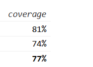
Due to the complexity of certain functions in server.py, 
such as generating charts or graphical representations 
in the frontend, achieving a high test coverage rate has 
been challenging. However, it should be noted that the 
majority of the CRUD (Create, Read, Update, Delete) 
operations have been covered by tests. These tests have 
proven to be immensely valuable during the development of 
our applications. While the coverage may not be exhaustive 
due to the specific nature of certain functionalities, the 
implemented tests have provided significant support and 
confidence in the overall robustness of the system


## 4.	Build


### Front-end Build (Vue.js):

1. Technology/Tools/Frameworks:

   - Node.js: JavaScript runtime used to execute build scripts and manage dependencies.
   - npm (Node Package Manager): Used to install and manage project dependencies.
   - Vue CLI (Command-Line Interface): A development tool for scaffolding and managing Vue.js projects.

2. Tasks executed in the build and final artifacts produced:

   - Installation of project dependencies: This includes Vue.js itself and any additional libraries or packages required by your project.

   - Compilation and bundling of front-end assets: The build process compiles Vue.js components, CSS styles, and other static assets into optimized and minified files.

   - Generation of production-ready artifacts: The final output typically includes HTML, CSS, and JavaScript files that can be served by a web server.

   - ```shell
     npm install
     npm run dev
     ```

3. Buildfile or related artifacts/scripts:

   - Vue CLI generates a configuration file called `vue.config.js` in project's root directory. This file can be customized to modify the build process, configure webpack, and handle other build-related tasks. 

   - Find more information about `vue.config.js` in the Vue CLI documentation: [Vue CLI Configuration Reference](https://cli.vuejs.org/config/).

   - URL of  `vue.config.js` :https://github.com/skylynf/SUSTechACD/blob/main/vue.config.js

   - Part of Snapshot:

     >  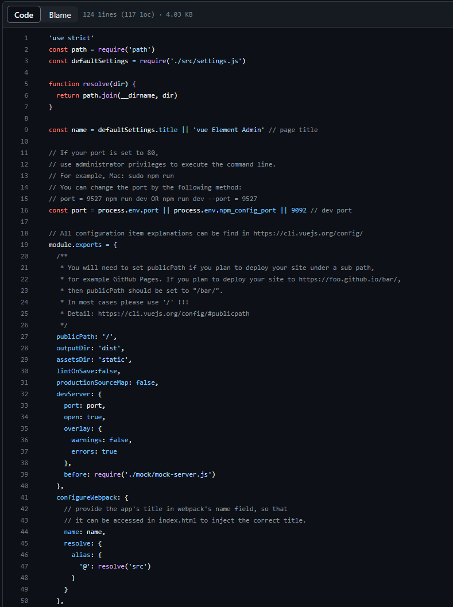

   - The `package.json` file is a manifest file that contains metadata about your project and its dependencies. It is also used to define various scripts that can be executed using npm.

   - URL of `package.json` : https://github.com/skylynf/SUSTechACD/blob/main/vue.config.js

   - Part of Snapshot:

     >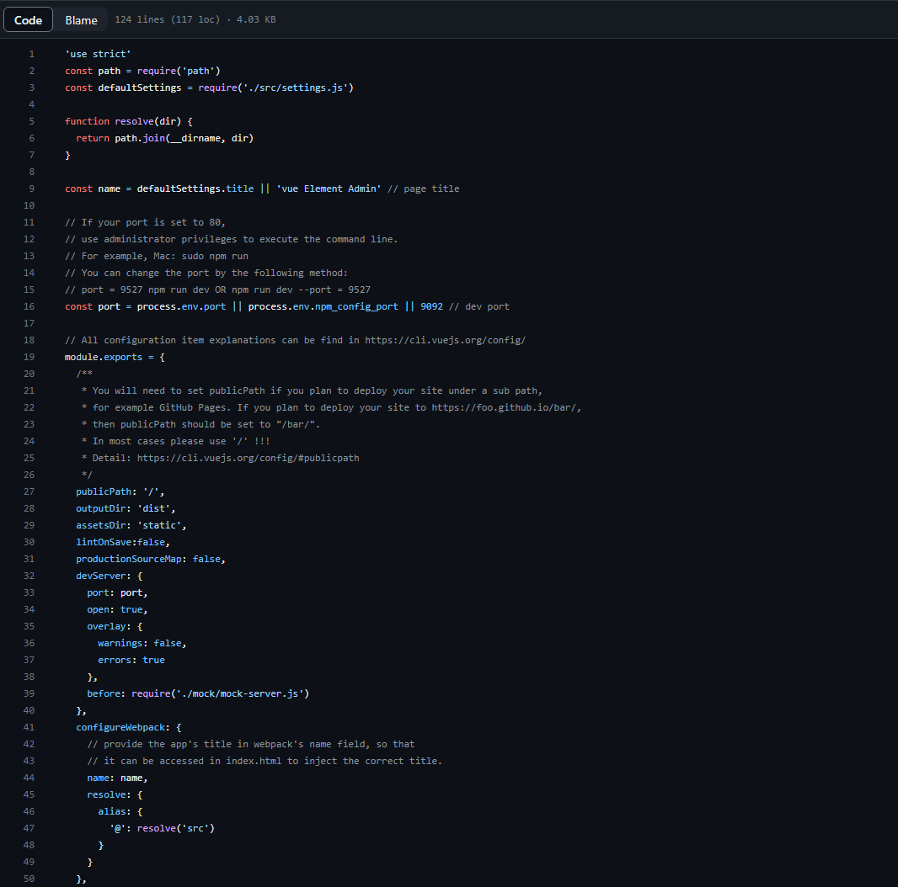


### Back-end Build (Python Flask):

1. Technology/Tools/Frameworks:

   - Python: Programming language used for back-end development.
   - pip: Package installer for Python used to manage project dependencies.
   - Flask: Micro web framework for Python used to build the back-end server.

2. Tasks executed in the build and final artifacts produced:

   - Dependency installation: Installation of required Python packages, including Flask and any additional libraries.

   - Configuration and setup: The build process might involve setting up environment variables, configuring the database connection, and other initialization steps.

   - ```shell
     pip install
     python -m flask run
     ```

3. Buildfile or related artifacts/scripts:

   - In Python Flask projects, build scripts are typically not as standardized as in front-end frameworks. 


## 5.	Deployment

1. Introduce the containerization technology/tools/frameworks used in your project.

In our project, the containerization tools are Nginx and WSGI. This solution is small in size, easy to install, fast in response, easy to use, no additional modification to the code, and completely realize the front end and back end separation.

2. The script or related artifacts used for containerization. Briefly introduce how you assigned different services into different
containers.

For the frontend, when you run __npm run dev__, the vue code will run directly, while when you run __npm run build:prod__, the vue code will be transcribed into html/css/js and stored in the dist folder in the root directory, which is done. This way, the packaged code is decoupled from node.js and can be copied to run on any machine without having to install vue and nodejs.

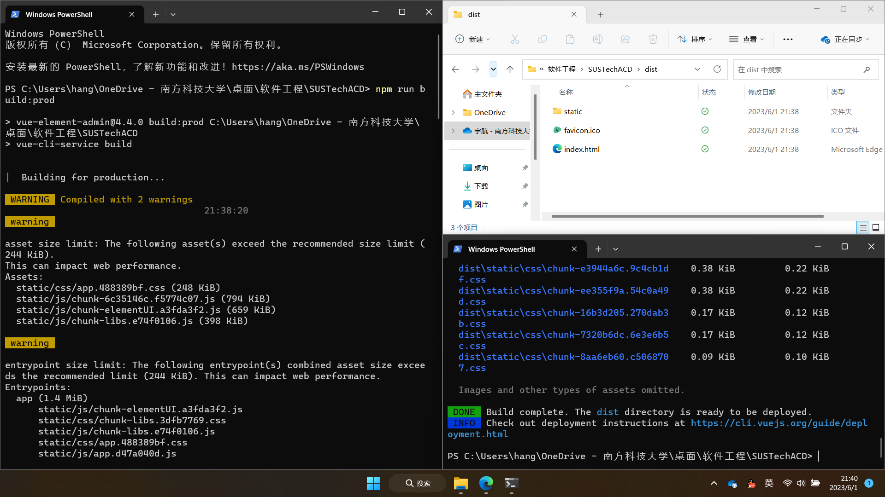

Here, another computer is simulated as a WSL virtual machine. The frontends are deployed by first installing the Nginx library and then starting the Nginx server by binding a network port (e.g., localhost:9000) to the dist folder path.

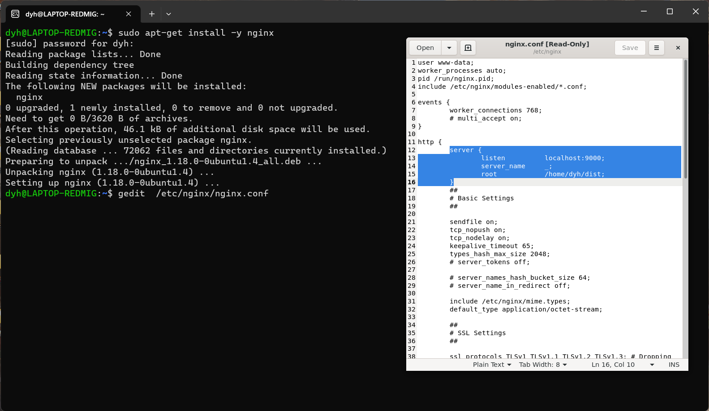

For the backend, our programs are written on python's Flask server. However, Flask is intended for development only, so it should be deployed with a WSGI interface. As a result, the server can run automatically and sleep processes when there are no user requests to reduce power consumption.

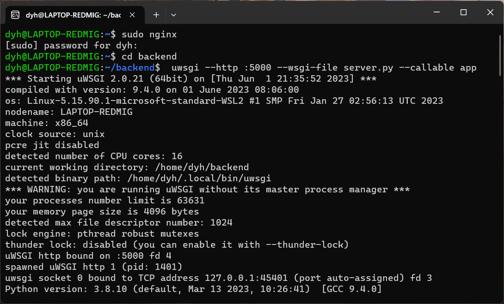

The reason why we adopt the separation of front and back ends is mainly because the requirements of front and back ends are different. Our front-end packaging and deployment has addressed the issues of time-consuming, error-prone, copy-controlled vue and nodejs; Backend applications need to access the database and can't run without data, so packaging a copy of the database is a very insecure behavior and should not be packaged with the frontend.

3. A proof of successful containerization.

The running results of the program after packaging and deployment are as follows. The UI and various functions are completely the same as without packaging and deployment.
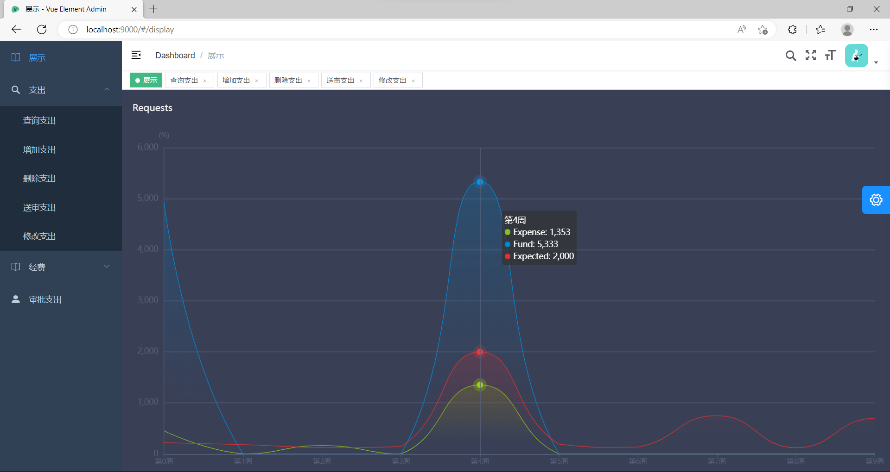
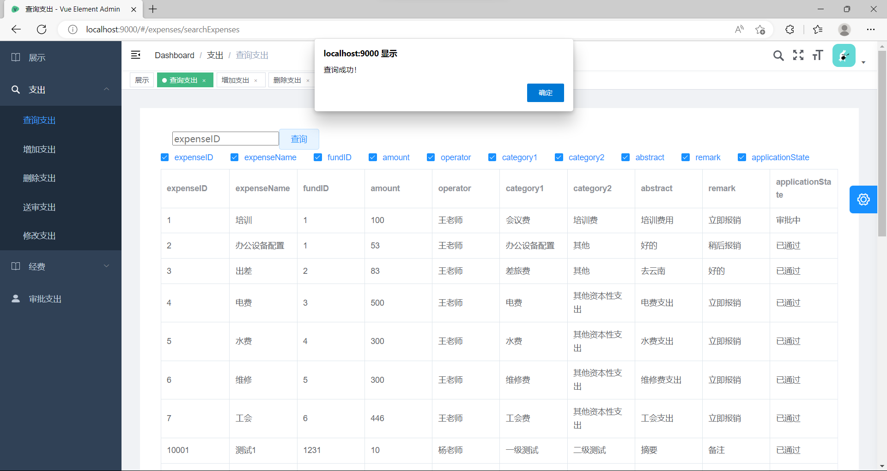
